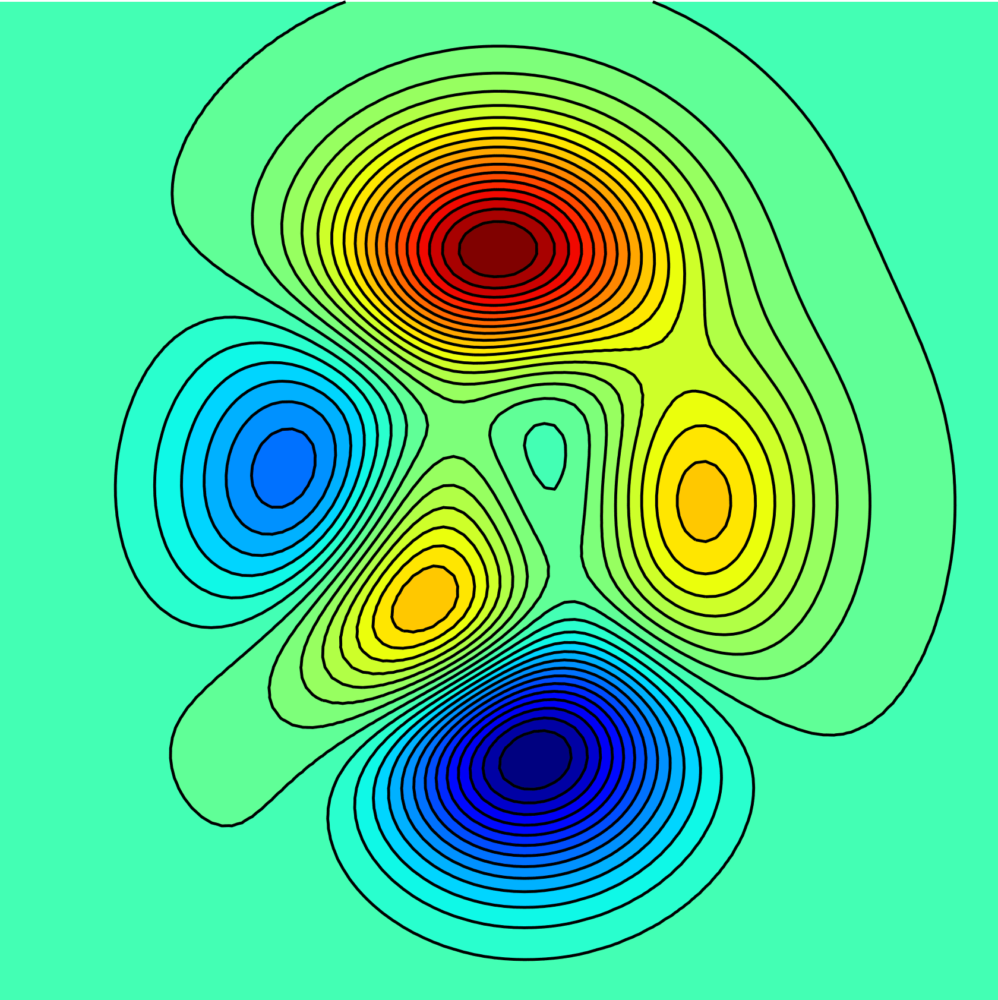
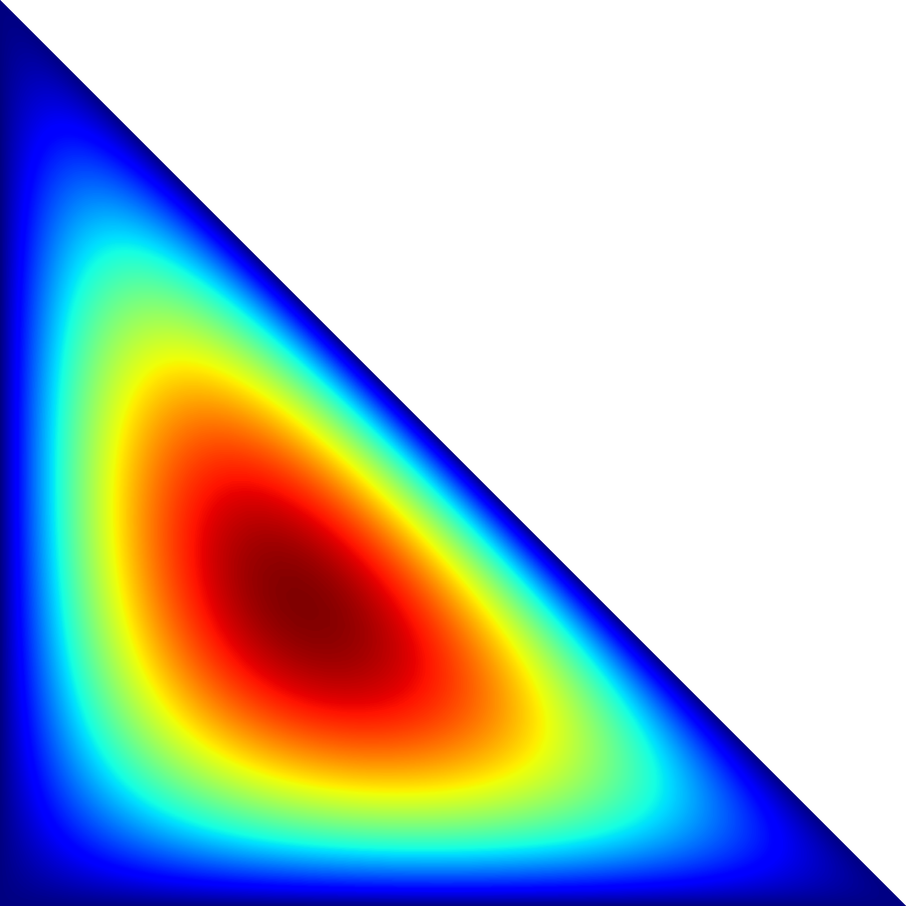
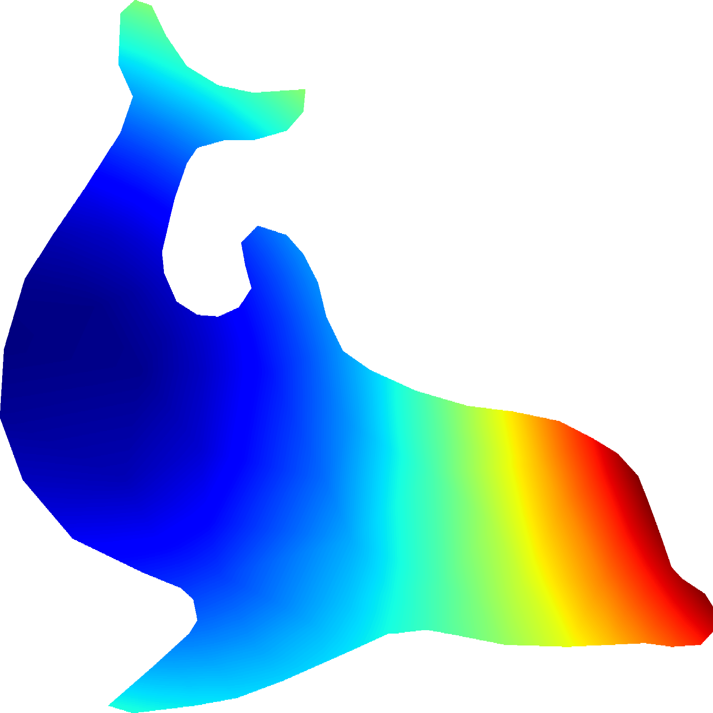

= Triplot.jl

This package provides functionality for drawing contour lines, filled contour
regions, and pseudocolor plots for data defined on unstructured triangular
meshes in Julia. The plotting functionality is based on
https://gr-framework.org[GR]. The contouring algorithm is inspired by
https://matplotlib.org[matplotlib].

== Usage

Triplot.jl provides three plotting functions: `tricontour`, `tricontourf`, and
`tripcolor`.

Each of these functions takes `x`, `y`, `z`, and `t` arrays. `x`, `y`, and `z`
are one-dimensional arrays of length `nv`, where `nv` is the number of vertices
in the triangular mesh. `x` and `y` define the coordinates of the vertices, and
`z` defines the function values at each vertex.

The array `t` is an integer array of size `(3,nt)`, where `nt` is the number of
triangles in the mesh. `t[i,j]` is the index of the `i`th vertex of the `j`th
triangle, and so `(x[t[i,j]], y[t[i,j]])` are its coordinates.

`tricontour` and `tricontourf` take a `levels` argument, that can either be an
integer (for evenly spaced levels between the data bounds), or an array of
values corresponding to contour lines. `tricontourf` will fill the regions
defined _between_ contour lines.

`tripcolor` generates a rasterized pseudocolor plot. The range used to compute
the pseudocolor values can be set by specifying `zmin` and `zmax` values (if
none are provided, the extremal values of the `z` array will be used).

Coloring is done using the current colormap in GR. This colormap can be set to
one of the built-in colormaps using `GR.setcolormap`, or it can be set to a
custom colormap using `GR.setcolormapfromrgb`. This is illustrated in the
example `ex_contour.jl` in order to draw contour lines of a uniform color.

== Examples

Some simple examples are provided in `examples/ex_contour.jl` and `examples/ex_pcolor.jl`.

=== Contours

image::img/diag.png[diag,500,500]

image::img/sine.png[sine,500,500]

=== Pseudocolor

image::img/sine_pcolor.png[sine_pcolor,500,500]

