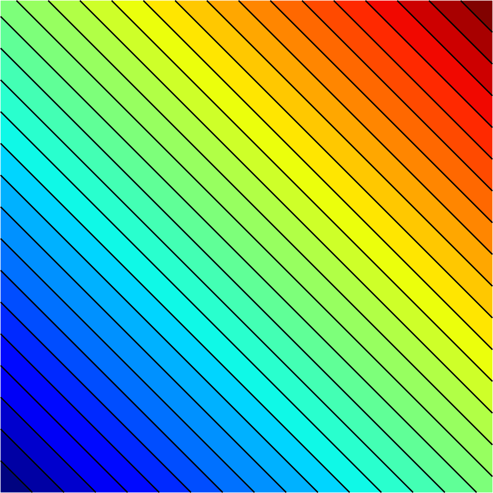
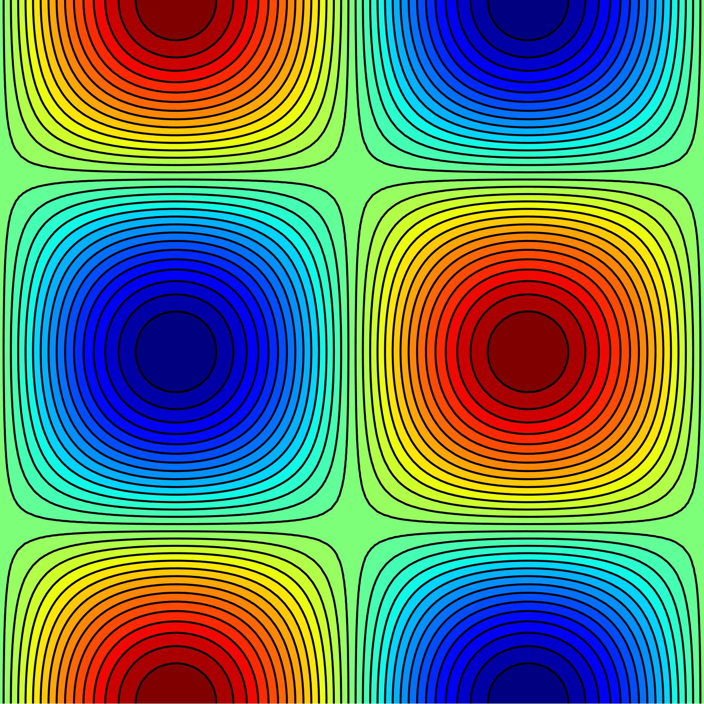

= Tricontour.jl

This package provides functionality for drawing contour lines and filled contour
regions for data defined on unstructured triangular meshes in Julia. The
plotting functionality is based on https://gr-framework.org[GR]. The algorithm
is inspired by https://matplotlib.org[matplotlib].

== Examples

Some simple examples are provided in `examples/example.jl`.

image::examples/peaks.png[peaks,500,500]

